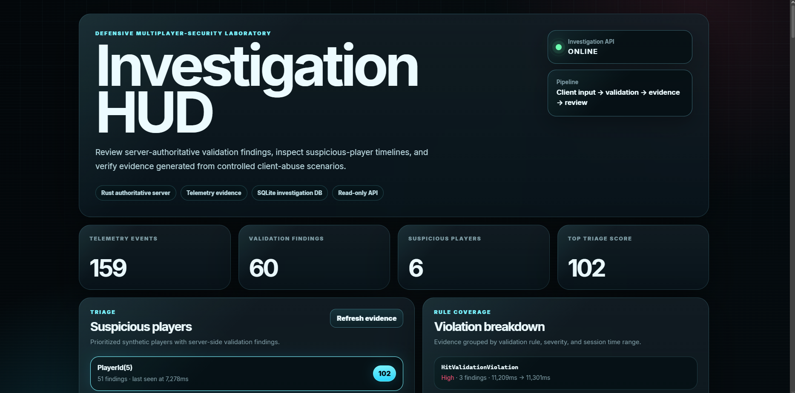
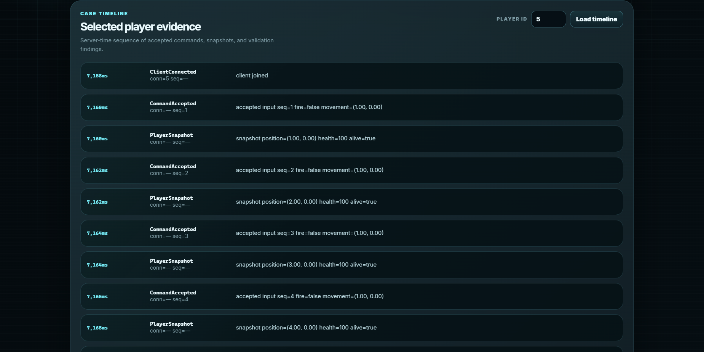
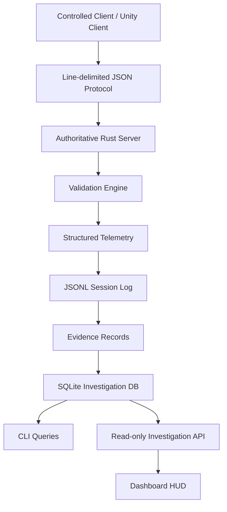

# Unity Rust Authoritative Security Sandbox

A defensive multiplayer-security sandbox for server-authoritative validation, structured telemetry, evidence generation, and investigation tooling.



This repository models a focused anti-cheat engineering workflow for an online multiplayer game: untrusted clients submit gameplay requests, the authoritative server validates those requests, suspicious behavior becomes evidence, and investigators can review the session through CLI, SQLite, API, and dashboard tools.

It is not a commercial anti-cheat product and it does not contain offensive tooling. The project is a lawful, self-contained laboratory for demonstrating server authority, evidence quality, false-positive awareness, reproducible demos, and security-focused software engineering.

## Core idea

```text
untrusted client input
        ↓
authoritative Rust server
        ↓
server-side validation
        ↓
structured telemetry
        ↓
evidence records
        ↓
SQLite investigation database
        ↓
CLI / API / dashboard review
```

The client is treated as untrusted. It can request movement, firing, and hit claims, but it does not own final state. The server validates claims against authoritative state and records findings as reviewable evidence.

## What this project proves

| Area | Evidence in this repository |
|---|---|
| Server authority | Rust server owns player state, command validation, target validation, cooldowns, and rejection logic |
| Game-security reasoning | Movement, timing, sequence, protocol, rate-limit, and hit-claim validation |
| Evidence discipline | Findings include observed values, expected limits, severity, reason, player ID, sequence, and server time |
| Investigation workflow | JSONL telemetry, evidence export, SQLite database, CLI queries, read-only API, dashboard HUD |
| Production mindset | Docker demo, CI-ready workspace, feature freeze, threat model, false-positive analysis, release process |
| Safety boundary | No cheat loaders, bypasses, injection tooling, kernel code, DMA tooling, or live-service targeting |

## Current validation coverage

| Validation area | Finding |
|---|---|
| Claimed movement exceeds server envelope | `SpeedHack` |
| Fire request arrives before cooldown expires | `FireRateViolation` |
| Action is impossible in current authoritative state | `InvalidStateTransition` |
| Command sequence does not increase | `PacketSequenceViolation` |
| Client timestamp moves backward or jumps too far | `ClientTimeViolation` |
| Protocol message is malformed or unsupported | `ProtocolViolation` |
| Connection exceeds message-rate limit | `RateLimitViolation` |
| Client hit claim fails server geometry | `HitValidationViolation` |

A finding is evidence, not punishment. This sandbox does not ban, kick, suspend, or penalize players.

## Investigation dashboard

The dashboard is served by the read-only investigation API and gives a recruiter-friendly view of the evidence pipeline.



The HUD shows:

```text
API health
telemetry event count
validation finding count
suspicious player triage
violation breakdown
selected player evidence timeline
```

The dashboard does not read telemetry or SQLite directly. It consumes the API, keeping presentation separate from storage and investigation logic.

## Repository structure

```text
crates/
  protocol/             Shared protocol types and telemetry event schema
  validation/           Pure validation logic and evidence conversion
  telemetry/            JSONL telemetry reader/writer
  investigation/        SQLite storage and investigation queries
  investigation-api/    Read-only HTTP API and dashboard hosting
  server/               Authoritative TCP game-security server
  bot/                  Controlled synthetic client scenarios
  cli/                  Operator and investigation commands

config/
  default.toml          Local server configuration
  docker.toml           Docker server configuration

dashboard/
  index.html            Investigation HUD structure
  styles.css            Dashboard visual system
  dashboard.js          API-backed dashboard behavior

docs/
  architecture.md
  threat-model.md
  rule-catalog.md
  false-positives.md
  investigation-workflow.md
  release-process.md
  screenshots.md

screenshots/
  dashboard-overview.png
  dashboard-player-timeline.png
```

## Technology stack

```text
Rust
Tokio
Axum
SQLite
Serde
Docker Compose
Bash / Just
Unity client integration scripts
HTML / CSS / JavaScript dashboard
GitHub Actions-ready workflow
```

## Run the full demo

The fastest review path is the Docker demo:

```bash
just docker-demo
```

The demo verifies the complete workflow:

```text
server starts
synthetic clients run
telemetry is generated
evidence is exported
SQLite investigation database is created
database queries run
investigation API starts
API and dashboard routes pass smoke checks
```

Generated artifacts:

```text
samples/session.jsonl
reports/evidence.json
reports/evidence.csv
reports/investigation.db
```

## Manual local run

Terminal 1:

```bash
rm -f samples/session.jsonl
cargo run -p server
```

Terminal 2:

```bash
cargo run -p bot -- normal
cargo run -p bot -- suspicious
cargo run -p bot -- sequence
cargo run -p bot -- timing
cargo run -p bot -- flood
cargo run -p bot -- bad-protocol
cargo run -p bot -- hit
cargo run -p bot -- bad-hit
```

Inspect telemetry and evidence:

```bash
cargo run -p cli -- summary samples/session.jsonl
cargo run -p cli -- risk samples/session.jsonl
cargo run -p cli -- timeline samples/session.jsonl
cargo run -p cli -- evidence samples/session.jsonl
```

Export evidence:

```bash
cargo run -p cli -- export-evidence samples/session.jsonl reports/evidence.json reports/evidence.csv
```

Create the investigation database:

```bash
cargo run -p cli -- ingest-db samples/session.jsonl reports/investigation.db
```

Query the database:

```bash
cargo run -p cli -- query-db suspicious-players reports/investigation.db
cargo run -p cli -- query-db violation-breakdown reports/investigation.db
cargo run -p cli -- query-db player-timeline reports/investigation.db 8
```

Start the API and dashboard:

```bash
cargo run -p investigation-api -- serve reports/investigation.db 127.0.0.1:8080
```

Open:

```text
http://127.0.0.1:8080
```

## Bot scenarios

| Scenario | Purpose |
|---|---|
| `normal` | Baseline valid client behavior |
| `suspicious` | Movement and fire-rate validation findings |
| `sequence` | Repeated packet sequence rejection |
| `timing` | Invalid client timestamp behavior |
| `flood` | Connection message-rate limiter validation |
| `bad-protocol` | Unsupported protocol version rejection |
| `hit` | Valid hit-claim validation |
| `bad-hit` | Invalid hit-claim evidence |

Run a single scenario:

```bash
cargo run -p bot -- bad-hit
```

## Architecture



The main trust boundary is between the client and the server.

Trusted side:

```text
authoritative server state
validation policy
server clock
telemetry writer
evidence conversion
investigation database
read-only API
```

Untrusted side:

```text
client position claims
client timestamps
client sequence numbers
client hit claims
client target IDs
client claimed distances
client message rate
client protocol version
```

## Documentation

| Document | Purpose |
|---|---|
| [Architecture](docs/architecture.md) | System design, crate responsibilities, data flow, trust boundaries |
| [Threat model](docs/threat-model.md) | Assets, attacker model, abuse cases, safety scope |
| [Rule catalog](docs/rule-catalog.md) | Validation findings, evidence fields, limitations |
| [False-positive analysis](docs/false-positives.md) | Production risks, reviewer checklist, mitigation principles |
| [Investigation workflow](docs/investigation-workflow.md) | How telemetry becomes reviewable evidence |
| [Screenshots](docs/screenshots.md) | Final screenshot set and presentation standards |
| [Release process](docs/release-process.md) | Quality gates, feature-freeze rule, release discipline |
| [Security policy](SECURITY.md) | Defensive-use boundary and prohibited uses |
| [Changelog](CHANGELOG.md) | Version history grounded in Git tags and commits |

## Safety boundary

This repository does not include:

```text
cheat loaders
game bypasses
DLL injection tooling
kernel evasion
DMA tooling
real-game memory scanning
real-game offsets
credential theft
malware
attacks against live games or services
instructions for evading real anti-cheat systems
```

All suspicious behavior is synthetic and targets only this repository’s local toy server.

The intended impression is direct: this project is a defensive, evidence-based multiplayer-security sandbox built with server authority, reproducibility, and investigation workflow in mind.