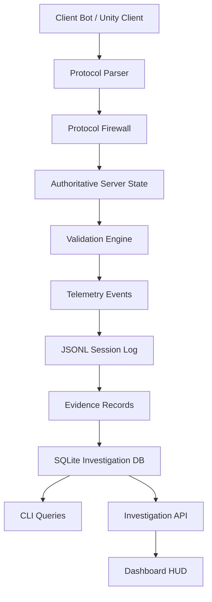

# Architecture

This project is a defensive multiplayer-security sandbox.

It models one focused slice of anti-cheat engineering: an untrusted client sends gameplay requests, the server validates those requests against authoritative state, suspicious behavior is recorded as telemetry, and the resulting evidence can be reviewed through CLI, database, API, and dashboard tools.

```text
client bot / Unity client
        ↓
line-delimited JSON protocol
        ↓
authoritative Rust server
        ↓
validation engine
        ↓
structured telemetry
        ↓
JSONL session log
        ↓
evidence records
        ↓
SQLite investigation database
        ↓
CLI / API / dashboard
```

## Design boundary

The project is intentionally scoped to server-authoritative validation and investigation workflow.

It does not attempt to be a commercial anti-cheat client, a kernel-level protection system, a real-game scanner, or a bypass-resistant endpoint product. The repository is a controlled defensive laboratory for multiplayer-security engineering.

The current feature set is considered enough for the backend/security slice. Future work should focus on documentation, screenshots, dashboard polish, and final portfolio presentation rather than adding unrelated systems.

## Crate responsibilities

### protocol

The `protocol` crate defines the shared data contract used by the server, bot, validation layer, telemetry layer, CLI, database, and API.

It owns:

```text
PlayerId
EntityId
Vec2
InputCommand
HitClaim
ClientMessage
ServerMessage
PlayerSnapshot
SuspicionKind
SuspicionReport
TelemetryEvent
```

The protocol crate should remain small and stable. It should define types, not runtime behavior.

### validation

The `validation` crate contains pure validation logic.

It owns:

```text
movement validation
fire-rate validation
packet sequence validation
client timestamp validation
hit-claim validation
evidence-record conversion
```

This crate does not open sockets, write files, query databases, or render UI. It receives explicit state and policy, then returns deterministic validation decisions.

That boundary matters because validation logic must be testable without the server runtime.

### server

The `server` crate owns authoritative runtime state.

It handles:

```text
TCP listener
connection lifecycle
protocol parsing
protocol version checks
message size checks
rate limiting
authoritative player state
deterministic test targets
validation invocation
telemetry emission
```

The server does not perform investigation queries. It produces telemetry.

### telemetry

The `telemetry` crate owns JSONL persistence.

It handles:

```text
append telemetry event
read telemetry events
```

The telemetry file is an append-only record of what the server observed during a session.

### investigation

The `investigation` crate owns SQLite ingestion and query logic.

It handles:

```text
database migration
event ingestion
violation ingestion
suspicious-player query
violation-breakdown query
player-timeline query
database health query
```

This crate is the boundary between raw telemetry and investigator-friendly data access.

### cli

The `cli` crate provides local operator workflows.

It supports:

```text
summary
risk
timeline
evidence
export-evidence
ingest-db
query-db suspicious-players
query-db violation-breakdown
query-db player-timeline
```

The CLI is useful for debugging, local review, Docker demo automation, and reproducible evidence inspection.

### investigation-api

The `investigation-api` crate exposes read-only HTTP endpoints over the investigation database.

It supports:

```text
GET /health
GET /players/suspicious
GET /violations/breakdown
GET /players/:player_id/timeline
```

It also serves the static dashboard from the `dashboard/` directory.

The API does not mutate evidence and does not perform enforcement.

### bot

The `bot` crate provides controlled synthetic clients.

It supports scenarios for:

```text
normal behavior
movement and fire-rate violations
packet sequence violations
client timestamp violations
message flooding
bad protocol version
valid hit claim
invalid hit claim
```

The bot is not a cheat tool. It is a test client for this local sandbox.

## Runtime flow

### 1. Join

A client sends a `ClientMessage::Join` message.

The server validates the protocol version. If the version is accepted, the server registers the player and emits a `ClientConnected` telemetry event.

### 2. Input command

A client sends a `ClientMessage::Input` message.

The server validates:

```text
sequence monotonicity
alive state
client timestamp monotonicity
movement claim
fire cooldown
```

If the command is accepted, the server updates authoritative player state and emits:

```text
CommandAccepted
PlayerSnapshot
```

If suspicious behavior is observed, the server emits a `Suspicion` telemetry event.

### 3. Hit claim

A client sends a `ClientMessage::HitClaim` message.

The server validates:

```text
target existence
non-empty direction vector
maximum hit distance
claimed distance consistency
ray-to-target distance
```

A valid hit claim receives `HitAccepted`.

An invalid hit claim receives `Rejected` and emits `HitValidationViolation` evidence.

### 4. Telemetry

Telemetry is written to:

```text
samples/session.jsonl
```

Telemetry events are line-delimited JSON. This keeps the event log easy to inspect, replay, export, and ingest.

### 5. Evidence

Suspicion reports are converted into evidence records.

An evidence record contains:

```text
player ID
sequence number
violation code
severity
reason
observed value
expected limit
server time
```

The project separates evidence from enforcement. A finding is not a ban.

### 6. Investigation database

Telemetry can be ingested into SQLite:

```text
reports/investigation.db
```

The main tables are:

```text
events
violations
```

The database supports queries for suspicious players, violation breakdowns, and player timelines.

### 7. API and dashboard

The investigation API exposes read-only data to the dashboard.

The dashboard displays:

```text
API health
event count
violation count
suspicious players
violation breakdown
selected player timeline
```

The dashboard does not read JSONL or SQLite directly. It consumes the API.

## Trust boundaries

The main trust boundary is the client/server boundary.

The client is untrusted. The client may send requests, but it does not own final gameplay state.

Trusted side:

```text
authoritative server state
validation policies
telemetry writer
investigation database
operator CLI
read-only investigation API
```

Untrusted side:

```text
client position claims
client timestamps
client sequence numbers
client hit claims
client protocol version
client message rate
client target claims
client claimed distance
```

## Enforcement boundary

This project does not enforce punishment.

The correct lifecycle is:

```text
validation finding
        ↓
evidence record
        ↓
investigation view
        ↓
human review or policy decision
```

A production system would need rollout modes, review queues, appeals, access control, privacy review, and audit logging before enforcement.

## Data flow



## Why the project is structured this way

The architecture is intentionally separated into small responsibilities.

Validation is pure so it can be tested directly.

The server owns runtime state but does not own investigation queries.

Telemetry is append-only so session history can be replayed and inspected.

The investigation database exists because evidence needs queryable structure.

The API exists because the dashboard should not depend on file or database internals.

The dashboard exists because reviewer-facing security tooling is part of the anti-cheat workflow, not decoration.

## Current architecture limits

The sandbox uses simplified 2D gameplay state. It does not model full physics, real Unity netcode, inventory, economy, raids, building placement, recoil, spread, line of sight, historical hitboxes, or lag-compensated rewind.

Those omissions are intentional for this repository. The project proves the architecture and investigation workflow, not every possible anti-cheat subsystem.

Future projects should cover native C++/C#/Unity/reverse-engineering topics separately instead of forcing them into this repo.